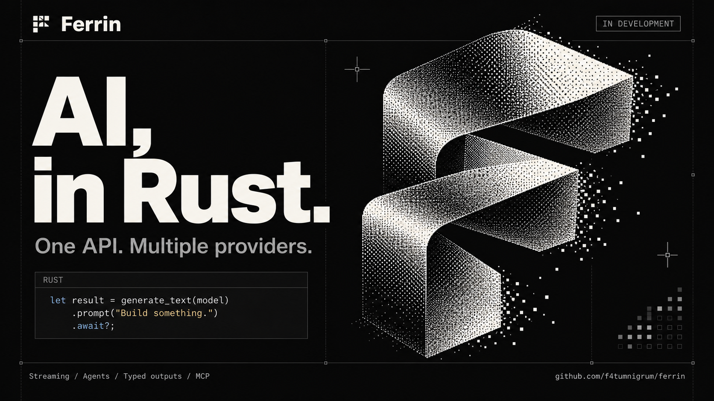

# Ferrin

**English** | [Chinese](README.zh-CN.md)



[](https://github.com/f4tumnigrum/ferrin/actions/workflows/ci.yml)
[](https://crates.io/crates/ferrin)
[](https://docs.rs/ferrin)
[](rust-toolchain.toml)
[](#license)

Ferrin is an AI SDK for Rust. It provides a provider-independent interface for text generation, streaming, tools with approval, agent loops, structured output, and other modalities including embeddings, images, speech, transcription, reranking, and video. It includes an MCP client and OpenTelemetry export. First-party adapters cover OpenAI, Anthropic, Google Generative AI, and any OpenAI-compatible endpoint.

This checkout contains the 0.1.2 release, with [release notes dated 2026-09-16](CHANGELOG.md#012---2026-09-16). It adds model middleware and policy-based tool approval, including execution-boundary and diagnostic safeguards. The schema API migration introduced in 0.1.1 still applies to callers upgrading from 0.1.0; see [ADR 0019](docs/04-decisions/2026-09-15-0019-fallible-schema-transforms.md). Registry publication is tracked separately in the [release record](docs/03-engineering/06-versioning-and-release.md#10-release-012-2026-09-16).

## Features

- **Unified model interface**: `generate_text` / `stream_text` use the same builders across providers. Switch providers by replacing the model handle.
- **Tool calling**: `#[ferrin::tool]` turns an async function into a tool with JSON Schema. Includes multi-step tool loops, `stop_when` conditions, provider-executed tools, and dynamic tools.
- **Human approval**: tools can require approval. Requests carry HMAC signatures, and approval decisions return as messages.
- **Structured output**: `Output::<T>::object()` fills a Rust type deriving `JsonSchema`, with partial objects and array elements available during streaming.
- **Agents**: `ToolLoopAgent` packages a model, instructions, tools, and stop conditions into a reusable agent with hooks for each step.
- **Streaming pipeline**: separate event streams and final results, text streams, smoothing, raw chunk passthrough, and direct SSE forwarding.
- **Other modalities**: embeddings, images, speech synthesis, transcription, speech translation, reranking, video, file and skill uploads, batches, and realtime sessions.
- **MCP client**: Streamable HTTP, SSE, and stdio transports, OAuth authorization, and server tools exposed as a tool set.
- **Policy-based approval**: `ferrin-policy` resolves tool approvals through OPA-style policies (an HTTP policy server or embedded Rego), with shadow mode and a capability middleware.
- **Observability**: `tracing` spans follow the OpenTelemetry GenAI semantic conventions; `ferrin-otel` exports spans and metrics.
- **Engineering constraints**: no `unsafe`, no `unwrap` in library code, a shared transport for all HTTP, and `secrecy` types that keep keys out of logs.

## Quick start

Requires Rust 1.98 or later. The crates.io dependency below selects an available 0.1 release; the git dependency follows the repository checkout.

```toml
[dependencies]
ferrin = { version = "0.1", features = ["openai"] }
tokio = { version = "1", features = ["macros", "rt-multi-thread"] }
```

To follow development on the main branch, use a git dependency: `ferrin = { git = "https://github.com/f4tumnigrum/ferrin", features = ["openai"] }`.

Set `OPENAI_API_KEY`, then run:

```rust
use ferrin::openai::{create_openai, OpenAiSettings};
use ferrin::prelude::*;

#[tokio::main]
async fn main() -> Result<(), Box<dyn std::error::Error>> {
    let openai = create_openai(OpenAiSettings::default())?; // reads OPENAI_API_KEY
    let result = generate_text(openai.responses("gpt-5"))
        .system("You are a concise assistant.")
        .prompt("Explain backpressure in two sentences.")
        .await?;
    println!("{}", result.text());
    println!("{:?} output tokens", result.usage().output.total);
    Ok(())
}
```

`ferrin::prelude` exports common entry points, `Tool`/`ToolSet`, `Message`, `StreamEvent`, `Output`, `step_count`, and `serde`, `schemars`, `json!`, and `StreamExt`.

## Usage

### Streaming

```rust
let stream = stream_text(openai.responses("gpt-5"))
    .prompt("Write a haiku about ownership.")
    .await?;

// Text deltas only.
let mut text = std::pin::pin!(stream.text_stream());
while let Some(delta) = text.next().await {
    print!("{}", delta?);
}
```

For the complete event stream, split the result into an event stream and a completion handle:

```rust
let (mut events, completion) = stream.split();
while let Some(event) = events.next().await {
    match event {
        StreamEvent::TextDelta { text, .. } => print!("{text}"),
        StreamEvent::ToolCall(call) => println!("tool call: {}", call.tool_name),
        _ => {}
    }
}
let result = completion.await?;
println!("{} steps", result.steps.len());
```

### Tool calling

```rust
#[derive(Deserialize, JsonSchema)]
#[serde(crate = "ferrin::serde")]
#[schemars(crate = "ferrin::schemars")]
struct GetWeather {
    /// City name.
    city: String,
}

/// Returns the current weather for a city.
#[ferrin::tool]
async fn get_weather(input: GetWeather) -> Result<JsonValue, ToolError> {
    Ok(json!({ "city": input.city, "temperature_c": 18.5 }))
}

let tools = ToolSet::new().insert("get_weather", get_weather())?;
let result = generate_text(openai.responses("gpt-5"))
    .prompt("What is the weather in Berlin?")
    .tools(tools)
    .stop_when(step_count(3)) // up to three model calls in one invocation
    .await?;
```

The function's doc comment becomes the tool description, and the input type's `JsonSchema` becomes its parameter schema. Tools execute automatically within the same invocation, returning results to the model until it produces a final answer or a stop condition fires.

### Structured output

```rust
#[derive(Debug, Deserialize, JsonSchema)]
#[serde(crate = "ferrin::serde")]
#[schemars(crate = "ferrin::schemars")]
struct Recipe {
    name: String,
    ingredients: Vec<String>,
    minutes: u32,
}

let result = generate_text(openai.responses("gpt-5"))
    .prompt("Give me a vegetarian lasagna recipe.")
    .output(Output::<Recipe>::object())
    .await?;
let recipe: &Recipe = &result.output;
```

### Agent

```rust
let agent = ToolLoopAgent::builder(openai.responses("gpt-5"))
    .id("weather-assistant")
    .instructions("You answer weather questions. Use the tools.")
    .tools(ToolSet::new().insert("get_weather", get_weather())?)
    .stop_when(step_count(6))
    .on_step_end(|step: Arc<StepResult>| async move {
        for call in step.tool_calls() {
            println!("-> {}({})", call.tool_name, call.input);
        }
    })
    .build();

let result = agent
    .generate(AgentCall::prompt("What is the weather in Berlin and Tokyo?"))
    .await?;
```

### Tool approval

```rust
let delete_file = Tool::function::<DeleteFile>()
    .description("Deletes a file from the workspace.")
    .needs_approval(NeedsApproval::Always)
    .execute(|input: DeleteFile, _ctx: ToolContext| async move {
        Ok::<_, ToolError>(json!({ "deleted": input.path }))
    })
    .build();
let tools = ToolSet::new().insert("delete_file", delete_file)?;

let mut messages = vec![Message::user("Delete build/cache.bin.")];
let first = generate_text(openai.responses("gpt-5"))
    .messages(messages.clone())
    .tools(tools.clone())
    .await?;
messages.extend(first.response_messages());
for request in first.last_step().tool_approval_requests() {
    // Ask the operator, then record the decision.
    messages.push_approval_response(ToolApprovalResponse::approved(request.approval_id.clone()));
}

let second = generate_text(openai.responses("gpt-5"))
    .messages(messages)
    .tools(tools)
    .await?; // executes the approved call and finishes the answer
```

### MCP

```rust
use ferrin::mcp::{McpClient, McpClientConfig, ToolsOptions};
use ferrin::mcp::transport::TransportConfig;

let transport = TransportConfig::http(url::Url::parse("https://mcp.example.com/mcp")?);
let client = McpClient::connect(McpClientConfig::new(transport)).await?;
let tools = client.tools(ToolsOptions::default()).await?; // ToolSet backed by the server

let result = generate_text(openai.responses("gpt-5"))
    .prompt("Use the server's tools to sum 21 and 21.")
    .tools(tools)
    .stop_when(step_count(4))
    .await?;
client.close().await?;
```

Requires the `mcp` feature. For stdio, use `TransportConfig::stdio(command)`; see `examples/example-mcp`.

### Other providers

```rust
use ferrin::anthropic::{create_anthropic, AnthropicSettings};
use ferrin::google::{create_google, GoogleSettings};
use ferrin::openai_compatible::{create_openai_compatible, OpenAiCompatibleSettings};

let anthropic = create_anthropic(AnthropicSettings::default())?; // ANTHROPIC_API_KEY
let google = create_google(GoogleSettings::default())?; // GOOGLE_GENERATIVE_AI_API_KEY
let mut settings =
    OpenAiCompatibleSettings::new("local", url::Url::parse("http://localhost:11434/v1")?);
settings.api_key_env = Some("LOCAL_API_KEY".to_owned());
let local = create_openai_compatible(settings)?;

let claude = anthropic.messages("claude-sonnet-4-5");
let gemini = google.chat("gemini-2.5-flash");
let llama = local.chat("llama3");
```

All model handles implement `LanguageModel` and can be passed directly to `generate_text`, `stream_text`, or `ToolLoopAgent::builder`.

### Error handling

```rust
match generate_text(openai.responses("gpt-5")).prompt("hi").await {
    Ok(result) => println!("{}", result.text()),
    Err(error) if error.is_retryable() => eprintln!("transient: {error}"),
    Err(error) => return Err(error.into()),
}
```

`ferrin::Error` provides `kind()`, `status_code()`, and `is_retryable()`. Retryable provider errors use exponential backoff by default, configurable through `RetryPolicy`.

## Providers

| Provider | Crate / feature | Environment variables | Capabilities |
| --- | --- | --- | --- |
| OpenAI | `ferrin-openai` / `openai` | `OPENAI_API_KEY`, `OPENAI_BASE_URL` | Responses, Chat Completions, Completions, embeddings, images, speech, transcription, speech translation, files, skills, batches, realtime sessions |
| Anthropic | `ferrin-anthropic` / `anthropic` | `ANTHROPIC_API_KEY`, `ANTHROPIC_BASE_URL` | Messages (tools, structured output, extended thinking, citations), file uploads, skills, batches |
| Google Generative AI | `ferrin-google` / `google` | `GOOGLE_GENERATIVE_AI_API_KEY` | `generateContent`, embeddings, images, speech, transcription, video, files, batches, Live API sessions |
| OpenAI-compatible endpoints | `ferrin-openai-compatible` / `openai-compatible` | Configured in settings | Chat Completions, Completions, embeddings, images |

Full capability matrices, settings, and provider options are in `docs/providers/`: [OpenAI](docs/providers/openai.md), [Anthropic](docs/providers/anthropic.md), [Google](docs/providers/google.md), and [OpenAI-compatible endpoints](docs/providers/openai-compatible.md). To build an adapter, see the [Provider implementation guide](docs/01-architecture/17-provider-implementation-guide.md).

## Cargo features

Features of the `ferrin` facade crate:

| Feature | Contents | Default |
| --- | --- | --- |
| `macros` | `#[ferrin::tool]` attribute macro | Yes |
| `openai`, `anthropic`, `google`, `openai-compatible` | Corresponding provider crate, also exported under paths such as `ferrin::openai` | No |
| `mcp` | MCP client, including stdio and OAuth | No |
| `otel` | OpenTelemetry bridge, `ferrin::otel::OtelTelemetry` | No |
| `policy`, `policy-rego` | Policy-based tool approval (`ferrin::policy`); `policy-rego` adds the embedded Rego engine | No |
| `realtime` | Realtime session loop in `ferrin-core` (WebSocket) | No |

Crates can also be used independently. WebSocket streaming models in `ferrin-openai` (`realtime` transcription and speech translation) require that crate's own `realtime` feature.

## Examples

There are seven runnable examples under `examples/`. All read `OPENAI_API_KEY`; use `OPENAI_BASE_URL` and `OPENAI_MODEL` (default: `gpt-5`) to select an endpoint and model:

| Example | Description |
| --- | --- |
| `example-generate-text` | Single-step text generation, printing usage and warnings |
| `example-structured-output` | Fill a `Recipe` struct with model output |
| `example-tool-approval` | Execute a tool after confirmation in the terminal |
| `example-agent` | `ToolLoopAgent` with multiple tools defined by `#[ferrin::tool]` |
| `example-mcp` | Connect to an MCP server over stdio and use its tools (requires Node.js) |
| `example-stream-sse-server` | A hyper server sends `StreamEvent` values to a browser as Server-Sent Events |
| `example-otel` | Export spans following the GenAI semantic conventions to stdout |

```sh
OPENAI_API_KEY=... cargo run -p example-generate-text
OPENAI_API_KEY=... cargo run -p example-stream-sse-server   # then: curl -N 'http://127.0.0.1:3000/chat?prompt=hello'
```

Examples using tools also accept `OPENAI_PROVIDER_OPTIONS` (JSON grouped by provider name). Some third-party OpenAI-compatible proxies do not support Responses API `item_reference` entries. Set `OPENAI_PROVIDER_OPTIONS='{"openai":{"store":false}}'` to send complete items back in multi-step calls.

## Workspace

```text
crates/
  ferrin                   facade: re-exports, prelude, features
  ferrin-core              generation loop, streaming, structured output, agents, middleware, registry, modalities
  ferrin-spec              provider specification: model traits, prompt/content types, stream parts, errors
  ferrin-message           application messages, conversion to provider prompts, pruning
  ferrin-tool              tool definitions, tool sets, approval, repair, sandbox trait
  ferrin-schema            JSON Schema generation (schemars) and dynamic validation
  ferrin-provider-util     HTTP transport, SSE decoding, secure URL policy, settings
  ferrin-macros            #[ferrin::tool]
  ferrin-mcp               MCP client
  ferrin-otel              OpenTelemetry bridge
  ferrin-policy            policy-based tool approval (OPA REST, embedded Rego)
  ferrin-testing           mock models, fixture server, contract checks
  providers/ferrin-openai, ferrin-anthropic, ferrin-google, ferrin-openai-compatible
examples/                  seven runnable examples
xtask/                     repository tooling (cargo xtask ...)
docs/                      design documents, provider docs, API snapshots
verification/              prototypes behind the pending-verification items (separate workspace)
```

Layering rules: `ferrin-spec` depends on no other Ferrin crate; provider crates use `ferrin-spec`, `ferrin-provider-util`, and shared `ferrin-schema` transforms where needed; applications need only `ferrin`. All crates share a version during the `0.y` series.

## Project status

- All 16 crates, `xtask`, and seven examples are implemented (`ferrin-policy` was first published in 0.1.2). All 16 crates are published at version 0.1.2. Version 0.1.0 of every other crate was published to [crates.io](https://crates.io/crates/ferrin) on 2026-09-14 (tag `v0.1.0`); API documentation is on [docs.rs](https://docs.rs/ferrin).
- The local 2026-09-16 run passed 810 tests and skipped 10 live tests requiring real credentials. All 14 cross-platform CI jobs, coverage and CodeQL passed for the release commit; all 16 docs.rs builds succeeded. See the release record.
- Live endpoint verification: all seven examples and all live tests passed against a third-party OpenAI-compatible endpoint. The official OpenAI, Anthropic, and Google endpoints have not been tested with real credentials. Provider tests currently use handwritten fixtures (pending item PV-031).
- Of 32 pending-verification items in the design documents, 31 are closed. See [Pending verification](docs/05-appendix/02-pending-verification.md).

## Development

```sh
rustup show           # picks up rust-toolchain.toml (1.98.1)
cargo binstall --locked cargo-nextest cargo-deny cargo-shear cargo-insta \
    cargo-hack cargo-semver-checks cargo-llvm-cov typos-cli just
just check-all        # fmt, clippy, tests, doctests, docs, API snapshot, deny, shear, features, typos, docs lint
```

- Tests belong in `crates/<crate>/tests/suite/*.rs`, aggregated by `tests/all.rs`. Provider tests replay recorded responses from `tests/fixtures/` without network access.
- Live tests start with `live_` and are marked `#[ignore]`: `OPENAI_API_KEY=... just test -- --run-ignored only -E 'test(live_)'`.
- `cargo xtask` provides `publish-order`, `check-module-size`, `check-versions`, `record-fixture`, and `api-snapshot`. After public API changes, run `cargo xtask api-snapshot` and commit `docs/api/`.
- Benchmarks: `just bench` (criterion; reports in `target/criterion/report/index.html`; `just bench sse` filters by name). Coverage includes SSE decoding, partial JSON repair, schemas, message pruning, tool fingerprints, generation and streaming pipelines, three provider adapters against local fixture servers, and end-to-end facade streaming. Benchmarks do not access the network, their results are not committed, and they are not CI gates.
- See [CONTRIBUTING.md](CONTRIBUTING.md) and [AGENTS.md](AGENTS.md) for the contribution workflow and coding rules. Update each affected crate's `CHANGELOG.md` with its changes.

## Documentation

- [Design documentation](docs/README.md): architecture, public API, engineering standards, architecture decision records (ADRs), and appendices, including implementation records in each chapter.
- [API reference and examples](docs/02-api/02-api-reference.md): entry-point and builder signatures and usage.
- rustdoc: generated with `just doc`, with compilable documentation examples.

## Security

- API keys use `secrecy` types, are read lazily from environment variables, and stay out of logs and errors.
- Downloads and MCP endpoints follow the secure URL policy: HTTPS only, private network rejection, DNS pinning, and size limits.
- Tool approval signatures use HMAC-SHA256 with constant-time comparison.
- See [Security practices](docs/03-engineering/08-security-practices.md) for details.

## Acknowledgments

Ferrin's capability scope and core abstractions (provider specification, generation loop, tool approval, stream parts, and middleware) draw on the design of the [Vercel AI SDK](https://github.com/vercel/ai) (Apache-2.0). The core generation loop, provider adapters, and selected algorithms such as partial JSON repair and message pruning were ported from TypeScript to Rust with modifications. See [NOTICE](NOTICE) and the corresponding rustdoc attribution for affected crates and modules. Engineering practices (workspace conventions, lint configuration, and CI structure) draw on [OpenAI Codex](https://github.com/openai/codex).

Ferrin is an independent project, unaffiliated with Vercel or OpenAI and not an official project of either company.

## License

Apache-2.0 ([LICENSE](LICENSE)). Attribution for derived code is in [NOTICE](NOTICE); both files ship with every published crate.
