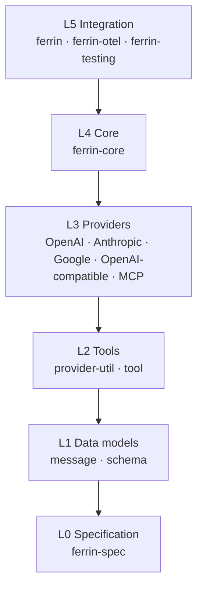
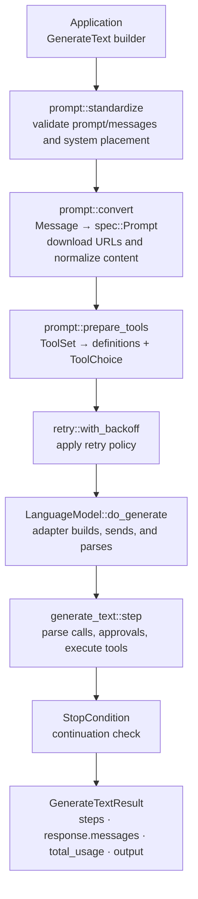
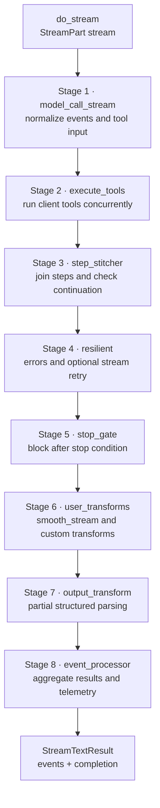

# Overall architecture

**English** | [Chinese](../zh-CN/01-architecture/01-overall-architecture.md)

## 1. Layers

[Fact] Major provider APIs differ in request shapes, stream events, and error bodies. Applications need to switch providers without changing business logic, and adapters need independent implementation and releases.

[Decision] Ferrin refines this layering into six Rust crate layers. Crates are Rust's compilation and dependency-resolution units; finer boundaries let adapters and the MCP client depend on lightweight crates without inheriting the core's compile time and dependency surface.



Dependencies flow downward only. Dependencies within a layer are listed in [Crate boundaries and responsibilities](02-crates.md).

## 2. Core data flow

### 2.1 Text generation (one step)



### 2.2 Streaming generation



See [Generation loop and streaming](07-generation-loop-and-streaming.md) for stage responsibilities and event types.

## 3. Cross-cutting mechanisms

| Mechanism | Location | Description |
| --- | --- | --- |
| Cancellation | All async APIs | Caller-supplied `CancellationToken`; the core derives child tokens for timeouts. See [Concurrency, cancellation, and timeouts](16-concurrency-and-cancellation.md). |
| Retries | `ferrin-core::retry` | Exponential backoff respecting `Retry-After`; `ApiCallError::is_retryable` determines eligibility. |
| Timeouts | `ferrin-core::timeout` | Total, step, first-chunk/inter-chunk (streaming only), tool, and per-tool-name timeouts. |
| Warnings | `ferrin-spec::Warning` | Produced by providers, logged through `tracing` by the core, and exposed in results. |
| Telemetry | `ferrin-core::telemetry` | Lifecycle callbacks and built-in `tracing` spans. |
| Provider passthrough | `ProviderOptions` / `ProviderMetadata` | JSON objects grouped by provider key; the core does not interpret their contents. |
| Security | `ferrin-provider-util::secure_url` | URL validation, private address rejection, redirect revalidation, download size limits. |

## 4. Runtime and concurrency model

[Decision] Tokio is the only supported async runtime. Concurrent tool execution, timeouts, and background aggregation require tasks and timers. Tokio is shared infrastructure for reqwest, tokio-tungstenite, and MCP SDKs; a runtime abstraction would add substantial maintenance for little benefit.

- Futures and streams returned by public async functions are `Send`.
- Library code never creates a runtime implicitly. Concurrent tools use `tokio::task::JoinSet`; callers must run within Tokio.
- Read files with `tokio::fs`. Perform base64 encoding and JSON parsing directly in async tasks without `tokio::task::spawn_blocking` ([Decision] revised 2026-09-14 from isolation through `spawn_blocking` with a benchmark-derived threshold; see [Concurrency and cancellation](16-concurrency-and-cancellation.md), section 7, and [ADR 0016](../04-decisions/2026-09-14-0016-inline-encoding-no-spawn-blocking.md)).

## 5. Dynamic dispatch

[Fact] Middleware and registries need dynamic object composition: middleware wraps a model and returns a new model object; registries resolve string IDs to models from any provider.

[Decision] Specification traits use native async/RPITIT signatures returning `impl Future + Send`, with an object-safe `Dyn*` adapter trait and blanket implementation for each. The core holds objects such as `Arc<dyn DynLanguageModel>`. Rationale:

- Coding standards require explicit `impl Future + Send` in traits, without `#[async_trait]`, keeping the `Send` bound visible and avoiding per-method boxing.
- Middleware, registries, and model references require dynamic dispatch. The object-safe layer confines boxing to core boundaries and keeps it out of provider implementations.
- [Fact] (PV-001, `verification/pv001-dynosaur`) `dynosaur` 0.3.1 can generate `DynLanguageModel<'a>` adapters for RPITIT traits returning `impl Future + Send`. `Arc<DynLanguageModel<'static>>` is `Send + Sync + 'static` and callable across `JoinSet` tasks. The generated type is an unsized struct, requires explicit `new_arc`/`new_box` construction and `?Sized` in generic code, and needs the `bridge(dyn)` option.
- [Decision] `ferrin-spec` retains handwritten `Dyn*` traits and blanket implementations without `dynosaur`. Public adapters should be ordinary trait objects (`Arc<dyn DynLanguageModel>`) supporting implicit coercion without `?Sized`; the specification should not depend on a 0.x procedural macro. The handwritten code is manageable: one adapter per model interface.

See [Provider specification](04-provider-spec.md), section 2, for the detailed shape.

## 6. Public API shape

[Decision] Application APIs primarily use builders with `IntoFuture`:

```rust
let result = ferrin::generate_text(&model)
    .system("You are a concise assistant.")
    .prompt("Summarize the Rust ownership model in three sentences.")
    .max_output_tokens(256)
    .await?;
```

A call has dozens of optional fields. Builders keep them discoverable and backward compatible because adding methods does not break callers; `IntoFuture` lets `.await` execute the call directly. See [API reference and examples](../02-api/02-api-reference.md) for the complete builder inventory.

## 7. Invariants

The following invariants apply across all crates:

1. The core imports no provider crate.
2. Provider crates import no core crate; they depend only on `ferrin-spec`, `ferrin-schema`, and `ferrin-provider-util`.
3. Specification data types implement `Debug + Clone + Serialize + Deserialize`, except stream and future types.
4. The public API exposes no third-party types other than those from `reqwest`, `schemars`, and `tokio_tungstenite`; exposed types are re-exported and covered by the versioning policy.
5. All network access goes through `ferrin-provider-util::http`; URLs come from application configuration or pass `secure_url` validation.

[Decision] (2026-09-17, [ADR 0025](../04-decisions/2026-09-17-0025-azure-and-voyage-providers.md)) The Azure adapter is an explicit exception to invariant 2: it imports `ferrin-openai` to reuse its wire model implementations. The core still imports no provider implementation.
