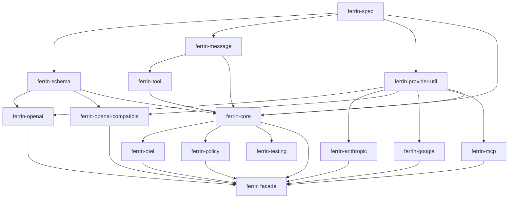

# Crate boundaries and responsibilities

**English** | [Chinese](../zh-CN/01-architecture/02-crates.md)

## 1. Naming

[Decision] Crate names use the `ferrin-` prefix and library names (`[lib] name`) use underscores (`ferrin_spec`). The prefix identifies first-party dependencies and avoids generic-name collisions on crates.io.

## 2. Crate inventory

| Crate | Layer | Responsibilities | Allowed first-party dependencies |
| --- | --- | --- | --- |
| `ferrin-spec` | L0 | Provider specification: model traits, prompts and content parts, call options, stream events, usage, finish reasons, warnings, provider options/metadata/references, specification errors, object-safe adapters. | None |
| `ferrin-schema` | L1 | `Schema<T>`, JSON Schema generation settings, validation, partial JSON repair, JSON parsing limits. | `ferrin-spec` (error types) |
| `ferrin-message` | L1 | Application messages: `Message`, convenient content forms, `FileSource`, `ToolResultOutput`, approval responses. | `ferrin-spec` |
| `ferrin-provider-util` | L2 | Shared adapter utilities: HTTP transport, response handlers, SSE decoding, retry classification, settings, provider option parsing, IDs, media type detection, User-Agent, secure URLs and downloads, reasoning-level and tool-name mapping, stream state-machine driver (`stream_driver`). | `ferrin-spec` |
| `ferrin-tool` | L2 | `Tool` definitions (`Tool`, `ToolKind`, `ToolSet`), execution context, output normalization, approval declarations, caller restrictions, `Sandbox` trait. | `ferrin-spec`, `ferrin-schema`, `ferrin-message` |
| `ferrin-openai` | L3 | OpenAI adapter: Responses, Chat Completions, Completions, Embeddings, Images, Speech, Transcription, Speech Translation, Files, Skills, Batch, Realtime. | `ferrin-spec`, `ferrin-schema`, `ferrin-provider-util` |
| `ferrin-anthropic` | L3 | Anthropic adapter: Messages, Files, Skills, Batch, provider tools. | Same as above |
| `ferrin-openai-compatible` | L3 | Generic adapter for OpenAI-compatible Chat, Completion, Embedding, and Image endpoints, used directly or reused by other adapters. | Same as above |
| `ferrin-google` | L3 | Google Generative AI adapter. | Same as above |
| `ferrin-mcp` | L3 | MCP client: Streamable HTTP, SSE, and stdio transports, OAuth, tool bridging, resources, prompts, elicitation. | `ferrin-spec`, `ferrin-schema`, `ferrin-tool`, `ferrin-provider-util` (`ferrin-message` was not needed in the 2026-09-14 implementation; see [MCP integration](15-mcp.md), section 6) |
| `ferrin-core` | L4 | Prompt normalization/conversion, text generation loop, streaming, structured output, agents, middleware, registry, retries/timeouts, telemetry interfaces, other modalities, core errors. | All L0–L2 crates |
| `ferrin-otel` | L5 | OpenTelemetry implementation of `Telemetry`, following GenAI semantic conventions. | `ferrin-core`, `ferrin-spec`, `ferrin-tool` (2026-09-14 implementation: `opentelemetry_sdk` is test-only; see [Observability](13-observability.md), section 9) |
| `ferrin-policy` | L5 | Policy-based tool approval: `PolicyClient`, decision normalization, `policy_approval`, shadow mode, capability middleware, OPA REST client, embedded Rego (feature `rego`). | `ferrin-core`, `ferrin-spec`, `ferrin-provider-util` (added 2026-09-15; see [Policy-based tool approval](18-policy-approval.md), ADR 0020) |
| `ferrin-testing` | L5 | Mock models, simulated streams, fixture replay, deterministic IDs/clocks, HTTP recording/replay. | `ferrin-core`, `ferrin-provider-util` |
| `ferrin-macros` | L5 | Procedural macro: `#[ferrin::tool]`. | None (generated code references `::ferrin::tool::*`, so use through the facade only; implemented 2026-09-14, see [Tool system](06-tool-system.md), section 1.1) |
| `ferrin` | L5 | Facade: re-export the `ferrin-core` public API and `prelude`; enable providers and extensions through features. | All |
| `xtask` | Engineering | Repository automation: fixture recording, version checks, publish order. Not published. | Any |

[Fact] The 2026-09-13 `ferrin-provider-util` implementation depends only on `ferrin-spec`: `parse_provider_options` validates through serde deserialization without `JsonSchema` (see [HTTP transport and security](14-http-and-security.md), section 7). The originally planned `ferrin-schema` dependency was removed.

## 3. Dependency graph



[Decision] `ferrin-mcp` does not depend on `ferrin-core`. MCP tools enter tool sets as dynamic tools and need only `ferrin-tool` and `ferrin-provider-util`, without core loop types. This also allows standalone MCP use outside generation.

## 4. Module structure by crate

### 4.1 `ferrin-spec`

```
src/
  lib.rs                 // explicit re-exports; SPEC_VERSION
  json.rs                // JsonValue = serde_json::Value, JsonObject aliases and helpers
  shared/
    provider_options.rs  // ProviderOptions, ProviderMetadata
    provider_reference.rs
    warning.rs
    headers.rs           // Headers wrapper around http::HeaderMap
    ids.rs               // ProviderId, ModelId, ToolCallId, ToolName, ApprovalId
  language_model/
    mod.rs               // LanguageModel trait
    call_options.rs      // CallOptions, ResponseFormat, ReasoningEffort, ToolChoice
    prompt.rs            // Prompt, PromptMessage, content parts, FileData
    tool.rs              // ToolDefinition::{Function, Provider}
    content.rs           // Content enum (generated result parts)
    stream_part.rs       // StreamPart enum
    result.rs            // GenerateResult, StreamResult, ResponseMetadata, RequestMetadata
    finish_reason.rs
    usage.rs
  embedding_model.rs
  image_model.rs
  speech_model.rs
  transcription_model.rs
  reranking_model.rs
  video_model.rs
  files.rs
  skills.rs
  batch.rs
  realtime_model.rs
  speech_translation_model.rs
  provider.rs            // Provider trait
  dynamic/               // object-safe Dyn* traits and blanket implementations
  error/                 // specification errors
```

### 4.2 `ferrin-core`

```
src/
  lib.rs
  error.rs
  ids.rs                 // IdGenerator and default implementation
  retry.rs
  timeout.rs
  prompt/
    standardize.rs
    convert.rs           // Message → spec::Prompt
    download.rs          // URL download policy and DownloadFn
    prepare_tools.rs
    prepare_tool_choice.rs
    call_options.rs      // application CallSettings → spec::CallOptions validation
  generate_text/
    builder.rs
    run.rs               // multi-step loop
    step.rs              // StepResult, StepContent
    parse_tool_call.rs
    repair.rs
    execute_tool.rs
    approval/            // parsing, signing, collection, validation, fingerprints
    stop_condition.rs
    prepare_step.rs
    response_messages.rs
    result.rs
  stream_text/
    builder.rs
    pipeline/            // one module per stage
    events.rs            // StreamEvent
    result.rs            // StreamTextResult, Completion
    transforms/          // smooth_stream and other transforms
  output/                // Output strategies: text, object, array, choice, json
  agent/
    mod.rs               // Agent trait
    tool_loop_agent.rs
  middleware/
    mod.rs               // LanguageModelMiddleware
    wrap.rs
    embedding.rs         // EmbeddingModelMiddleware, wrap_embedding_model
    image.rs             // ImageModelMiddleware, wrap_image_model
    provider.rs          // ProviderMiddleware, wrap_provider
    builtin/             // default_settings, default_embedding_settings, extract_reasoning, simulate_streaming, extract_json, add_tool_input_examples
  registry/
    provider_registry.rs
    custom_provider.rs
    default.rs           // explicitly configured process-wide default registry
  telemetry/
    mod.rs               // Telemetry trait, TelemetryOptions
    dispatcher.rs
    spans.rs             // tracing span names and fields
  embed/
  image/
  speech/
  transcription/
  rerank/
  video/
  files/
  skills/
  batch/
  realtime/
  speech_translation/
```

See [Coding standards](../03-engineering/03-coding-standards.md): target at most 500 lines per module; split modules exceeding 800 lines.

### 4.3 Standard provider crate layout

```
ferrin-openai/
  src/
    lib.rs                 // create_openai(), OpenAiProvider, settings types
    config.rs              // internal configuration: base_url, headers fn, transport, ID generator
    error.rs               // error response schema and failed_response_handler
    responses/             // one subdirectory per API family
      language_model.rs
      convert_prompt.rs    // spec::Prompt → API request messages
      convert_tools.rs
      map_finish_reason.rs
      options.rs           // provider option types and schemas
      api_types.rs         // serde response/chunk types
    chat/
    completion/
    embedding/
    image/
    speech/
    transcription/
    files/
    skills/
    batch/
    realtime/
    tools/                 // provider-defined/executed tool factories
  tests/
    fixtures/<api>/<case>.{chunks.txt,json}
    suite/                 // integration tests (wiremock replay)
```

### 4.4 `ferrin-policy`

```
src/
  lib.rs                 // re-exports
  client.rs              // PolicyClient, policy_client, SharedPolicyClient
  decision.rs            // PolicyDecision::normalize, into_approval
  approval.rs            // policy_approval, FailureMode, with_default, default_input
  shadow.rs              // shadow, Enforcement
  capability.rs          // capability_middleware, parse_allowlist
  http.rs                // HttpPolicyClient (OPA REST Data API)
  rego.rs                // RegoPolicyClient (feature `rego`, regorus)
  path.rs                // policy path normalization
  error.rs               // PolicyError
```

## 5. Feature gates

| Crate | Feature | Effect | Default |
| --- | --- | --- | --- |
| `ferrin-schema` | `json-schema-validation` | Use `jsonschema` to validate dynamic input without a Rust type | On |
| `ferrin-provider-util` | `reqwest` | Provide the default `ReqwestTransport` | On |
| `ferrin-provider-util` | `platform-verifier` | Depend directly on `rustls-platform-verifier` for system certificate verification (already enabled by default in reqwest 0.13; no `native-tls` feature, see CI documentation, section 3) | Off |
| `ferrin-tool` | `sandbox` | Compile the `Sandbox` trait and related execution-context fields | Off |
| `ferrin-core` | `realtime` | Compile `realtime` session APIs, adding WebSocket dependencies | Off |
| `ferrin-core` | `video` | Compile `video` generation APIs (polling/webhooks) | On |
| `ferrin-mcp` | `stdio` | Subprocess `stdio` transport | On |
| `ferrin-mcp` | `oauth` | OAuth authorization flow | On |
| `ferrin-policy` | `rego` | `RegoPolicyClient`: in-process Rego evaluation with `regorus` | Off |
| `ferrin` | `openai`, `anthropic`, `google`, `openai-compatible`, `mcp`, `otel`, `policy`, `policy-rego`, `macros`, `realtime` | Enable corresponding crates and re-export under `ferrin::providers::*` and at the crate root (`ferrin::openai`, etc.); `realtime` forwards `ferrin-core/realtime` (implemented 2026-09-14; see [API reference](../02-api/02-api-reference.md), section 14) | `macros` on; others off |

[Decision] Optional features between workspace crates must not change existing public type shapes or signatures; they only add APIs. Cargo feature unification can otherwise create untested combinations. A small, strictly additive feature set lets users trim dependencies without changing contracts.

## 6. Release units and version coordination

- Each crate has its own version; breaking changes in `ferrin-spec` cascade to all provider and core crates.
- The `ferrin` facade follows `ferrin-core`'s version.
- See [Versioning and release](../03-engineering/06-versioning-and-release.md) for coordination rules and process.

[Fact] On 2026-09-15, the OpenAI and OpenAI-compatible request encoders reuse strict transforms from `ferrin-schema`, rejecting unrepresentable dictionary schemas before sending requests (source: the two provider manifests and strict-schema request regression tests).
