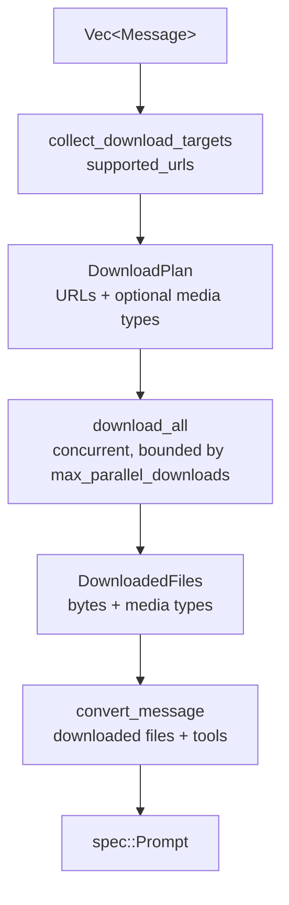

# Prompt normalization and message conversion

**English** | [Chinese](../zh-CN/01-architecture/05-prompt-conversion.md)

This document describes conversion of application input into specification `Prompt`, implemented in `ferrin-core::prompt`.

## 1. Normalization (`standardize`)

[Decision] Normalization rules:

- `prompt` and `messages` are mutually exclusive. Supplying both or neither returns `InvalidPrompt`.
- A string `prompt` becomes one user message; an array of `messages` is equivalent to `messages`.
- `system`, a string or `system` message with `provider_options`, is prepended to the sequence.
- System-role `messages` in `messages` are rejected unless `allow_system_in_messages(true)` is set.
- An empty `messages` array is an error.
- Invalid message structure returns `InvalidPrompt`.

[Decision] Builders expose `.system(...)`, `.prompt(text)`, and `.messages(vec)`; normalization runs when `IntoFuture` executes. Setting both `prompt` and `messages` is `Error::InvalidPrompt`, without silent merging. `allow_system_in_messages(bool)` remains an explicit switch, off by default.

```rust
pub(crate) struct StandardizedPrompt {
    pub system: Option<SystemMessage>,
    pub messages: Vec<Message>,
}
```

## 2. Conversion (`convert`)

[Decision] Conversion steps:

1. Collect URLs and media types from user file/image parts and match the model's `supported_urls`. Download unmatched URLs concurrently; the default downloader fetches only URLs the model cannot handle.
2. Inline downloaded bytes and media types as `data`, preferring response headers over magic-byte detection.
3. Normalize `image` to `file`; detect unspecified media types from magic bytes. If detection fails, images default to `image/*`; files require a media type.
4. Parse `data:` URLs into bytes and media types.
5. Preserve assistant `tool-result` parts (provider-executed results). Strip tool-message `tool-approval-response` before sending to the model; these responses serve only core replay.
6. Normalize tool output with `create_tool_model_output`: call the tool's `to_model_output` if present; otherwise map strings to `text`, other JSON to `json`, and errors to `error-text`/`error-json`.
7. Reconvert the complete message sequence on every later step, caching downloads within the invocation.

### 2.1 Ferrin conversion pipeline



[Decision] The download function is a trait object:

```rust
pub trait DownloadFn: Send + Sync {
    fn download(
        &self,
        requests: Vec<DownloadRequest>,           // { url, is_url_supported_by_model }
        cancellation: CancellationToken,
    ) -> BoxFuture<'_, Result<Vec<Option<DownloadedFile>>, DownloadError>>;
}
```

Returning `None` preserves the URL for the provider to fetch. `DefaultDownloader` downloads only items with `is_url_supported_by_model == false`, using `ferrin_provider_util::secure_url::fetch` (HTTPS, private network rejection, 100 MiB limit; see [HTTP transport and security](14-http-and-security.md)). A trait lets applications substitute caching or proxying; avoiding unnecessary downloads saves bandwidth when providers can fetch directly.

### 2.2 Media type detection

[Decision] Maintain a small magic-signature table for common image, audio, video, and PDF formats instead of adding a general library such as `infer`. The required format set is small, fixed, and fully testable; a general library adds unrelated formats and dependencies.

[Decision] `ferrin_provider_util::media_type::detect(bytes) -> Option<MediaType>` uses this table (PNG, JPEG, GIF, WebP, BMP, TIFF, AVIF, HEIC, MP3, WAV, OGG, FLAC, AAC, MP4, WebM, etc.), without `infer`. Keeping detection aligned with provider-supported types makes a local table easier to audit.

[Fact] The 2026-09-13 implementation names are `detect_media_type(bytes)` (`image`, PDF, `audio` excluding `audio/mp4`, then `video`), `detect_media_type_for(bytes, top_level)` (select `image`/`audio`/`video`/`application`; only this path returns `audio/mp4`, avoiding MP4 `audio`/`video` ambiguity), and `detect_media_type_base64(text, top_level)` (decode only the required prefix). Audio detection skips ID3 tags up to 128 KiB. Additional helpers are `media_type_to_extension` (`audio/mpeg` → `mp3`, etc.) and `resolve_full_media_type(media_type, inline_bytes)`, which completes partial types such as `image/*` or `image` by detection, returning `UnsupportedFunctionalityError` on failure.

### 2.3 Provider references

[Decision] File `data` may be a provider reference. Adapters resolve their own key with `resolve_provider_reference`, returning `NoSuchProviderReference` if missing. Files API references belong to the uploading provider; using them elsewhere is a caller error, not recoverable failure.

Conversion passes `FileSource::Reference` through unchanged; adapters validate and resolve it.

## 3. Tool preparation (`prepare_tools`, `prepare_tool_choice`)

[Decision] Tool preparation rules:

- If the tool set is empty, including after `active_tools` filtering, both `tools` and `tool_choice` are `None`.
- Function and dynamic tools become function definitions (`name`, `description`, `input_schema`, `strict`, `input_examples`, `provider_options`). Descriptions may be async functions receiving tool context.
- Provider-defined/executed tools become provider definitions (`id`, `name`, `args`).
- `tool_order` places named tools first in the supplied order, then other tools alphabetically.
- `tool_choice` is `auto`, `none`, `required`, or a named tool. Calls to tools outside the active set are marked invalid during parsing (see [Tool system](06-tool-system.md)).

[Decision] `prepare_tools` returns `PreparedTools { definitions: Vec<ToolDefinition>, tool_choice: Option<ToolChoice>, name_mapping: ToolNameMapping }`. Adapters use `name_mapping` from `ferrin_provider_util::tool_name_mapping` for reversible renaming when provider character restrictions reject a name. The core only requires nonempty `ToolName` values without whitespace.

## 4. Call settings validation (`call_options`)

[Fact] Provider sampling parameters have type/range constraints: maximum output tokens is an integer ≥1; temperature, top-p, top-k, and presence/frequency penalties are numeric; seed is an integer; stop sequences are string arrays.

[Decision] Rust types (`u32`, `f64`, `Vec<String>`) handle most validation. Runtime checks require only `max_output_tokens >= 1` and finite floating-point values. Failures return `Error::InvalidArgument { argument, message }`.

## 5. Response message assembly (`response_messages`)

[Decision] Convert a step's content into messages for subsequent model calls:

- Assistant messages include nonempty `text`, `reasoning`, `file`, `custom`, optional `source`, `tool-call`, provider-executed `tool-result`, and `tool-approval-request`.
- Client tool results and errors form one tool message, normalized through `create_tool_model_output`; errors use `error-text`/`error-json`.
- Denied approval produces `execution-denied` output.
- Emit no message if all content is empty.

`StepResult::response_messages()` and `GenerateTextResult::response_messages()` return `Vec<Message>` suitable for appending directly to application conversation history.

## 6. Message pruning

[Decision] `ferrin_message::prune` removes `reasoning`, tool calls, or empty messages to control context length. Options are `reasoning` (all / before last message / none), `tool_calls` (all / before last N messages / selected tools), and whether to retain empty messages. Use it in `prepare_step`. Reasoning and tool history dominate long contexts; rule-based pruning keeps messages semantically intact better than token truncation while retaining recent details.

```rust
pub fn prune(messages: Vec<Message>, options: &PruneOptions) -> Vec<Message>;

PruneOptions::new()
    .reasoning(ReasoningPrune::BeforeLastMessage)          // None (default) | All | BeforeLastMessage
    .tool_calls(PruneScope::before_last_message())         // All | BeforeLastMessages(n)
    .tool_calls_for(PruneScope::All, ["search"])           // rule restricted to named tools
    .keep_empty_messages();                                // default removes them
```

[Fact] Implementation on 2026-09-13: `before-last-N` preserves every occurrence of `tool_call_id`/`approval_id` referenced within the last N messages. Selected-tool rules remove only parts known to belong to those tools, also removing approval responses that cannot be linked to a tool call. `PruneScope::BeforeLastMessages(0)` is equivalent to `All`.

## 7. Verification items

- [Fact] (PV-002) `verification/pv002-data-url` compares 14 cases across naive comma splitting (`split(',')`, taking the first two segments and media type from `header.split(';')[0].split(':')[1]`, ignoring `;base64`, percent decoding, and extra payload commas, with an empty media type for `data:;base64,`), Ferrin's RFC 2397 parser, and `data-url` 0.3.2. All agree for ordinary base64 payloads without commas. For `data:text/plain,hello%20world`, the naive parser treats percent-encoded text as base64; Ferrin and `data-url` decode it correctly.
- [Decision] Implement RFC 2397 in `ferrin-message`: split at the first comma, match `;base64` case-insensitively, percent-decode non-base64 payloads, default an empty media type to `text/plain;charset=US-ASCII`, and tolerate whitespace and optional base64 padding. Do not add `data-url`: the roughly 60-line implementation maps precisely to `Error::InvalidDataContent`; WHATWG Fetch semantics such as fragment handling and permissive MIME parsing add no needed behavior, and whitespace/padding handling is already equivalent.
- [Decision] (PV-003) Default concurrent downloads to 8, configurable through `DownloadOptions::max_parallel`. This is comparable to common HTTP/1.1 per-host limits and accommodates typical multi-image prompts (usually ≤10 images) without dozens of connections to one origin. Track it in implementation-stage `benches/download.rs`; it is no longer pending verification.

## 8. Implementation record (2026-09-13)

- [Fact] `ferrin_core::prompt::Instructions { content, provider_options }`, re-exported as `ferrin_core::Instructions`, represents `system` input and implements `From<&str>`/`From<String>`. `standardize()` converts it to the first `system` message.
- [Decision] Construct `DefaultDownloader::try_default()` lazily, only when the prompt has an unsupported URL and the caller provided no `download`. Calls needing no downloads should not initialize TLS or connection pools or fail because transport construction failed.
- [Fact] `prepare_tools` first validates each tool's context schema against `tools_context` (failure: `Error::InvalidArgument { argument: "tools_context" }`), resolves dynamic descriptions, and generates `ToolDefinition`. It applies `active_tools` filtering and `tool_order` sorting. Batch text requests reuse this function.

[Decision] The normalized prepared tool choice also governs response validation in both generation loops; filtering away every tool removes the requirement for that step.
