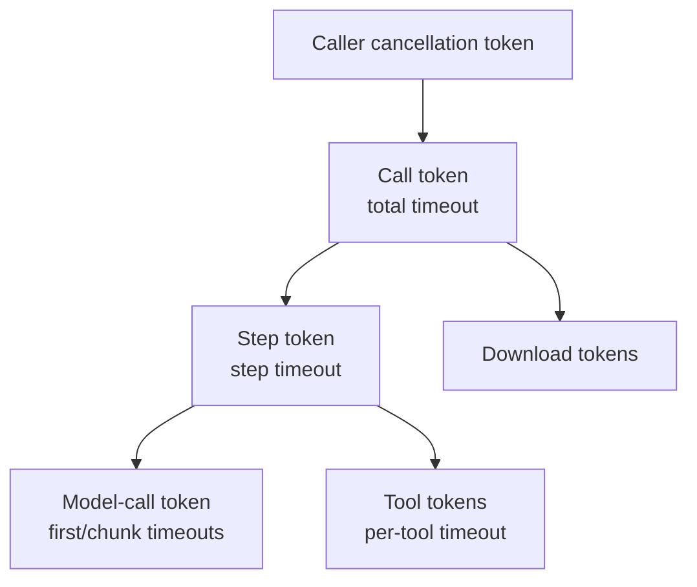

# Concurrency, cancellation, and timeouts

**English** | [Chinese](../zh-CN/01-architecture/16-concurrency-and-cancellation.md)

## 1. Cancellation model

[Decision] Combine caller cancellation and timers and pass them to models, downloads, and tools. Cancellation stops retries immediately with a cancelled reason; streaming invokes `on_abort` and emits `abort`. No layer may swallow cancellation and leave its caller waiting for timeout.

[Decision] Use `tokio_util::sync::CancellationToken` 0.7.19:

- Parent cancellation cancels child tokens. Timeouts wrap operations in `tokio::time::timeout` and cancel the corresponding child.
- Track caller cancellation versus timeout in a companion `OnceLock<CancelReason>` to map errors to `Error::Cancelled` or `Error::Timeout { scope }`.
- Adapters select on `CallOptions::cancellation` while sending HTTP and check cancellation while polling streams.

`CancellationToken` supports hierarchical derivation and `Send + Sync + Clone`, matching Tokio conventions.

## 2. Timeout implementation

| Timeout | Scope | Implementation |
| --- | --- | --- |
| `total` | Entire call, including steps and tools | Start a timer task at invocation, cancelling the call token on expiry |
| `step` | Model call and tools in one `step` | Reset at each `step` |
| `first_chunk` | Request to first streaming content chunk | Active after `StreamStart` until first content |
| `chunk` | Between adjacent content chunks | Reset `tokio::time::Sleep` on each content event |
| `tool` / `per_tool` | Individual `tool` execution | `timeout(duration, tool_future)`, mapped to `ToolError::Timeout` |

[Decision] Only content counts for first/inter-chunk timing; metadata such as `stream-start` and `response-metadata` does not reset it, because metadata can arrive before generation begins.

## 3. Concurrency points

| Location | Mechanism | Limit |
| --- | --- | --- |
| Prompt URL downloads | `JoinSet` | `max_parallel_downloads`, default 8 (PV-003) |
| Client tools | `JoinSet`, results via bounded `mpsc` | Unlimited by default; one task per tool |
| Embedding chunks | `JoinSet` or sequential, per model capability | `max_parallel_calls` |
| Image calls | `JoinSet` | Determined by `n / max_images_per_call` |
| MCP requests | Request-ID multiplexing on one connection | Unlimited |

[Decision] Manage tasks with `JoinSet`, never bare `tokio::spawn`. Dropping it cancels all children, preventing orphan tasks after cancellation or result disposal.

## 4. Backpressure

- Provider `BoxStream<StreamPart>` is pull-based: core reads response bodies only when consumers `poll`; network buffers supply backpressure.
- Tool result channels default to 64; full channels make tasks wait without dropping results.
- `StreamTextResult` has no unbounded internal buffer. Without event consumption, the pipeline stops and `Completion` cannot finish. API documentation requires consuming the stream or calling `consume()`.

## 5. Send and static bounds

- Public futures/streams are `Send` so applications may spawn them.
- Tool closures require static ownership, sharing state with `Arc`. `ToolContext.messages` uses `Arc<[Message]>` to avoid per-task copies.
- Models are shared as `Arc<dyn Dyn*Model>` without cloning internal state.

## 6. Synchronization rules

- Never await with a standard mutex guard, or hold an async mutex across long awaits. Clippy `await_holding_lock` and `await_holding_invalid_type` are deny-level in `clippy.toml`.
- One task owns event aggregation state, without locks.
- Read-only configuration uses Arc. Shared configuration such as default registries is set once with `OnceLock`, without `RwLock` or hot replacement.

## 7. Blocking operations

- [Decision] Revised 2026-09-14 in [ADR 0016](../04-decisions/2026-09-14-0016-inline-encoding-no-spawn-blocking.md): perform base64/JSON encoding in the caller's async task, without core/provider `spawn_blocking` or `block_in_place`, and remove encoding thresholds from core limits. This replaces the earlier >1 MiB blocking-pool policy; see the ADR rationale.
- Read application `FileSource::Path` files with `tokio::fs`.

## 8. Verification items

- [Fact] (PV-020, `verification/pv020-sleep-reset`, release) Per-chunk Sleep poll/`reset` costs 73 ns, versus 17 ns for Instant::now, negligible at hundreds/thousands of chunks per second.
- [Decision] Keep resettable Sleep for `chunk` timeouts rather than fixed-interval polling.
- [Decision] Channel capacity 64 and download concurrency 8 follow PV-006/PV-003; see [Generation loop](07-generation-loop-and-streaming.md), section 5, and [Prompt conversion](05-prompt-conversion.md), section 7.

[Decision] A pending tool output stream polls an owned cancellation future on every poll, registering its waker even without a tool timeout. Cancellation wakes the executor and drops the pending tool future when the call terminates.
