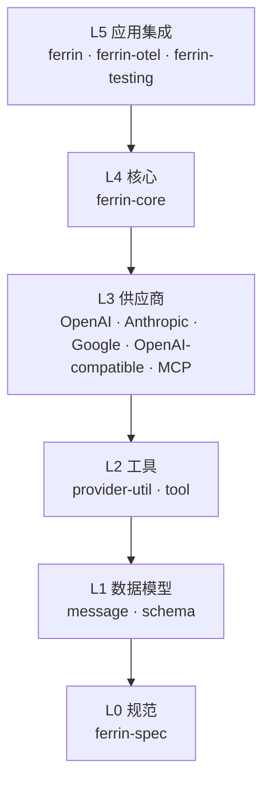
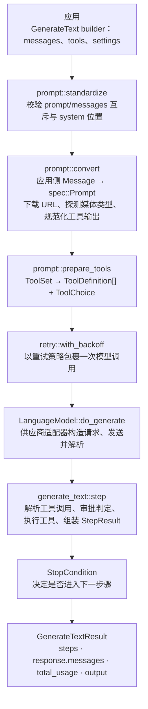
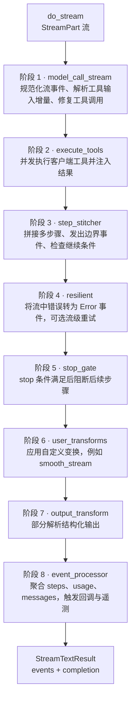

# 总体架构

[English](../../01-architecture/01-overall-architecture.md) | **简体中文**

## 1. 分层

【事实】主流供应商 API 的请求形状、流事件与错误体互不相同；应用需要在不改动业务代码的前提下切换供应商，供应商适配器需要能够独立实现与发布。

【决策】Ferrin 保留这一分层，并按 Rust 的 crate 边界细化为六个层次。依据：Rust 的编译单元与依赖解析以 crate 为粒度，细分层次可以让供应商适配器与 MCP 客户端只依赖轻量 crate，避免编译时间与依赖面随核心层膨胀。



依赖只能自上而下。同层 crate 之间的依赖关系在 [Crate 划分与职责](02-crates.md) 中逐一列出。

## 2. 核心数据流

### 2.1 文本生成（单步）



### 2.2 流式生成



各阶段的职责与事件类型见[生成循环与流式管线](07-generation-loop-and-streaming.md)。

## 3. 关键横切机制

| 机制 | 位置 | 说明 |
| --- | --- | --- |
| 取消 | 全部异步 API | `CancellationToken` 由调用方传入；核心层派生子令牌用于超时。见[并发、取消与超时](16-concurrency-and-cancellation.md)。 |
| 重试 | `ferrin-core::retry` | 指数退避，尊重 `Retry-After`，可重试性由 `ApiCallError::is_retryable` 决定。 |
| 超时 | `ferrin-core::timeout` | 总超时、步骤超时、首块/块间超时（仅流式）、工具超时、按工具名超时。 |
| 警告 | `ferrin-spec::Warning` | 供应商产生，核心层通过 `tracing` 记录并暴露在结果中。 |
| 遥测 | `ferrin-core::telemetry` | 生命周期回调接口 + 内置 `tracing` span。 |
| 供应商透传 | `ProviderOptions` / `ProviderMetadata` | 按供应商键分组的 JSON 对象，核心层不解释其内容。 |
| 安全 | `ferrin-provider-util::secure_url` | URL 校验、私网地址拒绝、重定向重校验、下载体积上限。 |

## 4. 运行时与并发模型

【决策】Ferrin 以 Tokio 为唯一支持的异步运行时。依据：流式管线依赖并发工具执行、超时与后台聚合，这些需要任务生成与定时器；Tokio 是 Rust 生态中 HTTP 客户端（reqwest）、WebSocket（tokio-tungstenite）与 MCP SDK 的公共基础，抽象运行时会显著增加维护面而收益有限。

- 所有公共异步函数返回的 Future 与 Stream 均为 `Send`。
- 库代码不隐式创建运行时；工具并发执行使用 `tokio::task::JoinSet`，要求调用方在 Tokio 运行时内调用。
- 文件读取使用 `tokio::fs`；base64 编码与 JSON 解析在异步任务内直接执行，不使用 `tokio::task::spawn_blocking`（【决策】2026-09-14 修订，原文为“通过 `spawn_blocking` 隔离，阈值以基准测试确定”，见[并发与取消](16-concurrency-and-cancellation.md)第 7 节与 [ADR 0016](../04-decisions/2026-09-14-0016-inline-encoding-no-spawn-blocking.md)）。

## 5. 动态分发策略

【事实】中间件与注册表需要对象级动态组合：中间件包装一个模型并返回新的模型对象，注册表按字符串 ID 返回任意供应商的模型实例。

【决策】规范层 trait 以原生 `async fn`/RPITIT 形式定义（返回 `impl Future + Send`），并为每个 trait 提供对象安全的 `Dyn*` 适配 trait 与 blanket 实现；核心层统一持有 `Arc<dyn DynLanguageModel>` 等对象。依据：

- 编码规范要求 trait 方法显式声明 `impl Future + Send`，不使用 `#[async_trait]`（`Send` 约束可见，且不逐方法装箱）。
- 中间件、注册表、模型引用需要动态分发；对象安全适配层把装箱成本限制在核心层边界，供应商实现者无需接触。
- 【事实】（PV-001，`verification/pv001-dynosaur`）`dynosaur` 0.3.1 可为返回 `impl Future + Send` 的 RPITIT trait 生成 `DynLanguageModel<'a>` 适配类型，`Arc<DynLanguageModel<'static>>` 满足 `Send + Sync + 'static`，可跨 `JoinSet` 任务调用；生成类型为不定长结构体（需 `new_arc`/`new_box` 显式构造，泛型代码需 `?Sized`），并要求 `bridge(dyn)` 选项。
- 【决策】`ferrin-spec` 仍手写 `Dyn*` trait 与 blanket impl，不引入 `dynosaur`。依据：公共 API 中的适配类型应是普通 trait 对象（`Arc<dyn DynLanguageModel>`），可隐式协变转换、不需要 `?Sized` 约束；规范层不应依赖 0.x 过程宏 crate；手写量可控（每类模型接口一份）。

详细形态见 [Provider 规范层](04-provider-spec.md) 第 2 节。

## 6. 公共 API 形态

【决策】应用侧 API 以构建器 + `IntoFuture` 为主形态：

```rust
let result = ferrin::generate_text(&model)
    .system("You are a concise assistant.")
    .prompt("Summarize the Rust ownership model in three sentences.")
    .max_output_tokens(256)
    .await?;
```

依据：一次调用有数十个可选字段；Rust 中构建器可以保持可选字段的可发现性与向后兼容（新增方法不破坏调用方），`IntoFuture` 使得 `.await` 直接触发调用。构建器的完整清单见 [API 参考与示例](../02-api/02-api-reference.md)。

## 7. 不变量

以下不变量在所有 crate 中强制：

1. 核心层不 import 任何供应商 crate。
2. 供应商 crate 不 import 核心层 crate，只依赖 `ferrin-spec`、`ferrin-schema`、`ferrin-provider-util`。
3. 规范层类型全部实现 `Debug + Clone + Serialize + Deserialize`（流与 Future 类型除外）。
4. 公共 API 中不出现 `reqwest`、`schemars`、`tokio_tungstenite` 以外的第三方类型；出现的第三方类型通过 re-export 暴露并在版本策略中声明。
5. 任何网络访问必须经过 `ferrin-provider-util::http`，且 URL 来自应用配置或经 `secure_url` 校验。
