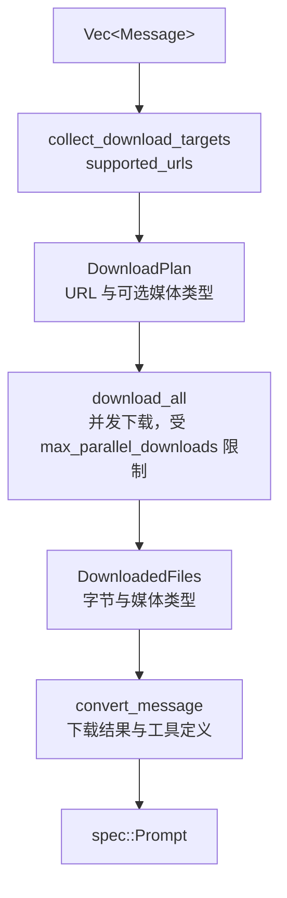

# Prompt 标准化与消息转换

[English](../../01-architecture/05-prompt-conversion.md) | **简体中文**

本文档描述应用侧输入如何变为规范层 `Prompt`，位于 `ferrin-core::prompt`。

## 1. 标准化（`standardize`）

【决策】标准化规则：

- `prompt` 与 `messages` 互斥，二者皆无或皆有时报 `InvalidPrompt` 错误。
- `prompt` 为字符串时转换为单条用户消息；为消息数组时等价于 `messages`。
- `system` 字段（可为字符串、带 `provider_options` 的系统消息或有序系统消息数组）被置于消息序列最前。
- 默认不允许 `messages` 中出现 `system` 角色消息；`allow_system_in_messages(true)` 时放行。
- `messages` 为空数组时报错。
- 消息结构校验失败时报 `InvalidPrompt` 错误。

【决策】Ferrin 构建器提供 `.system(...)`、`.prompt(text)`、`.messages(vec)` 三个入口，并在 `IntoFuture` 触发时执行标准化；`prompt` 与 `messages` 同时设置视为调用错误（`Error::InvalidPrompt`）而非静默合并。`allow_system_in_messages(bool)` 保留为显式开关，默认关闭。

```rust
pub(crate) struct StandardizedPrompt {
    pub system: Option<Instructions>,
    pub messages: Vec<Message>,
}
```

## 2. 转换（`convert`）

【决策】转换步骤：

1. 收集用户文件/图像片段以及助手/工具结果内容中的文件 URL 与媒体类型，与模型的 `supported_urls` 匹配；不匹配的 URL 通过下载器并发下载（默认下载器只下载模型不支持的 URL）。
2. 下载得到的字节内联为 `data` 形式。已声明的完整媒体类型优先于响应头，响应头补齐不完整类型；检测到的图片签名优先于两者。
3. `image` 部件归一化为 `file` 部件；未提供媒体类型时通过魔数探测，探测失败时 `image` 默认为 `image/*`，`file` 必须有媒体类型。
4. `data:` URL 被解析为字节与媒体类型。
5. 助手消息中的 `tool-result` 部件保留（供应商执行结果）；工具消息中的 `tool-approval-response` 在发送给模型前被剥离（审批响应只用于核心层重放）。
6. 工具结果输出经 `create_tool_model_output` 规范化：若工具定义了 `to_model_output`，调用之；否则字符串输出转为 `text`，其他 JSON 转为 `json`，错误转为 `error-text`/`error-json`。
7. 后续步骤中每次都对完整消息序列重新转换（下载结果在同一调用内缓存）。

### 2.1 Ferrin 的转换管线



【决策】下载函数是一个 trait 对象：

```rust
pub trait DownloadFn: Send + Sync {
    fn download(
        &self,
        requests: Vec<DownloadRequest>,           // { url, is_url_supported_by_model }
        cancellation: CancellationToken,
    ) -> BoxFuture<'_, Result<Vec<Option<DownloadedFile>>, DownloadError>>;
}
```

返回 `None` 表示保留 URL 由供应商自行拉取。默认实现 `DefaultDownloader` 只下载 `is_url_supported_by_model == false` 的项，经 `ferrin_provider_util::secure_url::fetch` 执行（HTTPS、私网拒绝、100 MiB 上限，见 [HTTP 传输与安全](14-http-and-security.md)）。依据：下载器作为 trait 让应用可以替换为带缓存或代理的实现；默认只下载模型不支持的 URL，避免为供应商本可直接拉取的资源支付带宽。

### 2.2 媒体类型探测

【决策】媒体类型探测依赖自维护的魔数签名表识别常见图像、音频、视频与 PDF 格式，不引入 `infer` 一类通用库。依据：需要识别的格式集合很小且固定，签名表可完整测试；通用库会带来与供应商支持列表无关的格式与依赖。

【决策】`ferrin_provider_util::media_type::detect(bytes) -> Option<MediaType>` 实现同一签名表（PNG、JPEG、GIF、WebP、BMP、TIFF、AVIF、HEIC、MP3、WAV、OGG、FLAC、AAC、MP4、WebM 等）；不引入 `infer` crate。依据：探测范围有限且需要与供应商接受的媒体类型列表保持一致，自维护表更容易审计。

【事实】2026-09-13 实现的函数名为 `detect_media_type(bytes)`（依次查图像、PDF、音频（不含 `audio/mp4`）、视频表）、`detect_media_type_for(bytes, top_level)`（按 `image`/`audio`/`video`/`application` 选表，`audio/mp4` 仅在此路径下返回，以避免 MP4 容器在音频与视频之间的歧义）与 `detect_media_type_base64(text, top_level)`（只解码探测所需的前缀）；音频探测前跳过 ID3 标签（最长 128 KiB）。另有 `media_type_to_extension`（`audio/mpeg` → `mp3` 等）与 `resolve_full_media_type(media_type, inline_bytes)`（`image/*` 或 `image` 形式的部分媒体类型经探测补全，失败返回 `UnsupportedFunctionalityError`）。

### 2.3 供应商引用

【决策】文件部件的 `data` 可以是供应商引用；适配器以 `resolve_provider_reference` 查找自身供应商键，缺失时返回 `NoSuchProviderReference` 错误。依据：引用由 Files API 上传产生，只对上传它的供应商有意义，跨供应商使用是调用方错误而非可恢复情形。

转换阶段原样透传 `FileSource::Reference`，不做校验；适配器负责解析。

## 3. 工具准备（`prepare_tools`、`prepare_tool_choice`）

【决策】工具准备规则：

- 工具集为空或经 `active_tools` 过滤后为空时，`tools` 与 `tool_choice` 皆为 `None`。
- 函数工具与动态工具转换为函数工具定义（`name`、`description`、`input_schema`、`strict`、`input_examples`、`provider_options`）；`description` 可以是接受工具上下文的函数，异步解析。
- 供应商定义/执行工具转换为供应商工具定义（`id`、`name`、`args`）。
- `tool_order` 决定发送顺序：列出的在前按给定顺序，其余按名称字母序。
- `tool_choice` 为 `auto`/`none`/`required` 或指定工具名；指向不在活动集合中的工具的调用在解析阶段标记为无效（见[工具系统](06-tool-system.md)）。

【决策】Ferrin 的 `prepare_tools` 输出 `PreparedTools { definitions: Vec<ToolDefinition>, tool_choice: Option<ToolChoice>, name_mapping: ToolNameMapping }`。`name_mapping` 用于工具名不合法（供应商限制字符集）时的双向重命名，该逻辑位于 `ferrin_provider_util::tool_name_mapping`，由适配器调用；核心层只保证 `ToolName` 非空且不含空白。

## 4. 调用设置校验（`call_options`）

【事实】供应商 API 对采样参数有类型与范围约束：最大输出令牌为 ≥1 的整数，temperature、top-p、top-k、presence/frequency penalty 为数值，seed 为整数，停止序列为字符串数组。

【决策】Rust 类型系统吸收大部分校验（`u32`、`f64`、`Vec<String>`）；保留运行时检查的只有 `max_output_tokens >= 1` 与浮点数非 NaN/非无穷。校验失败返回 `Error::InvalidArgument { argument, message }`。

## 5. 响应消息组装（`response_messages`）

【决策】响应消息组装把一步的内容转换为应发送回模型的消息：

- 助手消息包含 `text`（跳过空文本）、`reasoning`、`file`、`custom`、`source`（可选）、`tool-call`、供应商执行的 `tool-result`、`tool-approval-request`。
- 客户端工具结果与错误组成一条工具消息，输出经 `create_tool_model_output` 规范化；错误结果为 `error-text`/`error-json`。
- 被拒绝的审批产生 `execution-denied` 输出。
- 全部内容为空时不生成消息。

Ferrin 的 `StepResult::response_messages()` 与 `GenerateTextResult::response_messages()` 返回 `Vec<Message>`，可直接追加到应用维护的对话历史。

## 6. 消息裁剪

【决策】`ferrin_message::prune` 按规则删除推理、工具调用或空消息以控制上下文长度，参数为 `reasoning`（全部 / 最后一条消息之前 / 不删）、`tool_calls`（全部 / 最后 N 条消息之前 / 限定工具）与是否保留空消息，供 `prepare_step` 回调中使用。依据：长对话中推理与工具调用记录占据大部分上下文，而模型只需要最近几轮的细节；按规则裁剪比按令牌截断更能保留语义完整的消息。

```rust
pub fn prune(messages: Vec<Message>, options: &PruneOptions) -> Vec<Message>;

PruneOptions::new()
    .reasoning(ReasoningPrune::BeforeLastMessage)          // None (default) | All | BeforeLastMessage
    .tool_calls(PruneScope::before_last_message())         // All | BeforeLastMessages(n)
    .tool_calls_for(PruneScope::All, ["search"])           // rule restricted to named tools
    .keep_empty_messages();                                // default removes them
```

【事实】2026-09-13 实现：`before-last-N` 规则保留末尾 N 条消息中引用的 `tool_call_id`/`approval_id` 在全部消息中的出现；限定工具的规则只删除已知属于这些工具的部件，且把无法关联到工具调用的审批响应一并删除。`PruneScope::BeforeLastMessages(0)` 保留全部工具部分，与参考 `slice(-0)` 一致（ADR 0026，2026-09-17）。

## 7. 待验证

- 【事实】（PV-002）`verification/pv002-data-url` 以 14 个用例比较了三种 `data:` URL 解析：朴素的逗号切分（`split(',')` 取前两段，媒体类型取 `header.split(';')[0].split(':')[1]`，不解析 `;base64` 标志、不做百分号解码、载荷含逗号时截断、`data:;base64,` 得到空媒体类型）、Ferrin 自实现的 RFC 2397 解析器与 `data-url` 0.3.2。对 `;base64` 且无逗号的常规输入三者结果一致；对非 base64 载荷（`data:text/plain,hello%20world`）朴素解析会把百分号编码文本当作 base64 处理，自实现解析器与 `data-url` 则正确解码。
- 【决策】`ferrin-message` 自行实现 RFC 2397 解析（首个逗号切分、`;base64` 大小写不敏感、非 base64 载荷百分号解码、空媒体类型默认 `text/plain;charset=US-ASCII`、base64 解码忽略空白且填充可选），不引入 `data-url` crate。依据：自实现约 60 行并可与 `Error::InvalidDataContent` 精确对应；`data-url` 面向 WHATWG Fetch 语义（附带片段处理与宽松 MIME 解析），多出的行为无需求，且它对缺失填充/空白的处理与自实现一致，无额外收益。
- 【决策】（PV-003）并发下载上限默认 8，作为 `DownloadOptions::max_parallel` 可配置项。依据：不设上限时多图 prompt 会对单一源同时发起数十个连接；8 与常见 HTTP/1.1 每主机连接数上限同量级，足以覆盖多图 prompt（通常 ≤ 10 张）同时避免对单一源发起数十个并发连接。该值在实现阶段的 `benches/download.rs` 中持续跟踪，不再作为待验证项。

## 8. 实现记录（2026-09-13）

- 【事实】`ferrin_core::prompt::Instructions`（re-export 为 `ferrin_core::Instructions`）表示 `system` 输入。字符串构造器生成单条消息；当前枚举还接受有序系统消息数组（ADR 0026，2026-09-17）。
- 【决策】`DefaultDownloader::try_default()` 惰性构造：构建器不在配置阶段创建 HTTP 传输，只有当 prompt 中出现模型不支持的 URL 且调用方未提供 `download` 时才构造默认传输并下载。依据：无需下载的调用不应触碰 TLS 与连接池初始化，也不应因传输构造失败而报错。
- 【事实】`prepare_tools` 对每个工具先以 `tools_context` 校验上下文 schema（失败为 `Error::InvalidArgument { argument: "tools_context" }`），再解析动态描述并生成 `ToolDefinition`；`active_tools` 过滤与 `tool_order` 排序在此处应用。批处理的文本请求复用同一函数。

【决策】 两种生成循环均使用准备后归一化的工具选择校验响应；过滤掉全部工具时，也移除该步骤的强制工具调用要求。

【决策】 自定义 `DownloadFn` 接收收集到的全部 URL 及其模型支持标记，包括模型支持所有 URL 的提示。只有默认下载器可以跳过这种情况；自定义下载器可内联需要鉴权的文件，或返回 `None` 保留单个 URL。

【决策】 每次生成或流式调用按 URL 缓存成功下载的文件。后续步骤即使切换模型，也复用这些字节，保证单次调用内文件一致。`None` 结果与失败不缓存：后续模型的 URL 支持范围变化时，可能需要下载此前保留的 URL。不同调用使用独立缓存。

【决策】裁剪分别保护工具调用 ID 与审批 ID，与 Vercel AI SDK `6c6c221` 的 `prune-messages.ts` 一致。尾部审批部分不会隐式保护工具调用，尾部工具结果也不会隐式保护审批部分。需保留可恢复审批时，应选择包含必需部分的尾部范围（ADR 0026，2026-09-17）。

【决策】参考行为对齐（ADR 0026，2026-09-17）：`Instructions` 表示单条 `SystemMessage` 或有序的系统消息向量，字符串构造仍生成单条消息。`Instructions::messages` 及 `From<Vec<SystemMessage>>` 保留每条消息的供应商参数，并接受空向量（不添加系统消息）。提示转换及默认指令中间件按顺序前置全部配置消息；默认指令仅在提示中不存在系统消息时生效。遥测在现有输入记录开关启用时保留完整指令形状。

【决策】参考对齐（ADR 0026，2026-09-17）：删除用户消息中的空文本片段；保留携带供应商参数的助手空文本片段，过滤片段后仍保留助手消息。合并连续工具消息，将前一条消息的供应商参数递归合并到其最后片段，片段参数优先；最后消息的参数仍保留在消息层。在用户/系统消息边界与提示结尾拒绝缺少结果的客户端工具调用。关联的审批响应（批准或拒绝）豁免对应调用，供应商执行的调用无需客户端结果。下载目标还包含助手/工具结果内容中的文件 URL。已声明的完整媒体类型优先于下载响应头，响应头补齐不完整类型；检测到的图片签名优先于两者。来源：Vercel AI SDK `6c6c221` 的 `convert-to-language-model-prompt.ts`。

【决策】助手文件与推理文件的 data URL 转换为内联字节，使用 URL 内嵌媒体类型。推理文件仅接受内联数据或 URL，与参考供应商契约一致；文本及供应商引用在转换时失败。普通文件继续支持现有全部来源。
