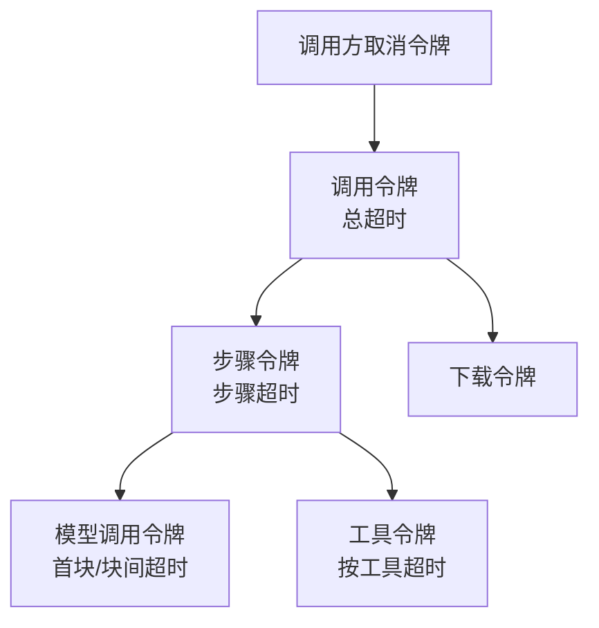

# 并发、取消与超时

[English](../../01-architecture/16-concurrency-and-cancellation.md) | **简体中文**

## 1. 取消模型

【决策】取消信号贯穿调用：应用传入的取消令牌与超时定时器合并后传递给模型调用、下载、工具执行；取消时重试立即终止（`RetryError` 的原因为已取消），流式调用触发 `on_abort` 并发出 `abort` 事件。依据：任何一层吞掉取消都会让上层等待到超时，统一传递是可预测取消的前提。

【决策】Ferrin 使用 `tokio_util::sync::CancellationToken`（0.7.19）作为取消原语：

- 子令牌在父令牌取消时自动取消；超时通过 `tokio::time::timeout` 包裹并在触发时取消对应子令牌。
- 取消原因需要区分“调用方取消”与“超时”：核心层在派生令牌旁维护 `CancelReason` 单元格（`OnceLock<CancelReason>`），错误映射时据此产生 `Error::Cancelled` 或 `Error::Timeout { scope }`。
- 供应商适配器收到 `CallOptions::cancellation`，在发起 HTTP 请求时用 `select!` 监听令牌并中止请求；流式读取中每次 `poll` 检查令牌。

依据：`CancellationToken` 支持层级派生与 `Send + Sync + Clone`，是 Tokio 生态的标准取消机制。

## 2. 超时实现

| 超时 | 作用域 | 实现 |
| --- | --- | --- |
| `total` | 整个调用（含所有步骤与工具） | 调用开始时 `spawn` 定时任务，到期取消 call token |
| `step` | 单步：模型调用 + 该步工具执行 | 每步开始重置 |
| `first_chunk` | 流式：从请求发出到第一个内容分片 | 在 `StreamStart` 之后、首个内容事件前生效 |
| `chunk` | 流式：相邻内容分片间隔 | 每个内容事件到达时重置定时器（`tokio::time::Sleep::reset`） |
| `tool` / `per_tool` | 单个工具执行 | `timeout(duration, tool_future)`，超时转 `ToolError::Timeout` |

【决策】首块与块间超时只对内容分片计时，`stream-start`、`response-metadata` 等元数据事件不重置计时。依据：元数据事件在模型开始生成前就会到达，若计入会让超时失去“模型是否在产出”的含义。

## 3. 并发点

| 位置 | 并发形式 | 上限 |
| --- | --- | --- |
| Prompt 转换中的 URL 下载 | `JoinSet` | `max_parallel_downloads`（默认 8，见 PV-003 决策） |
| 客户端工具执行 | `JoinSet`，结果经有界 `mpsc` 注入流 | 无上限；每个工具一个任务 |
| `embed_many` 分块 | `JoinSet` 或串行（按 `supports_parallel_calls`） | `max_parallel_calls` |
| `generate_image` 多次调用 | `JoinSet` | 由 `n / max_images_per_call` 决定 |
| MCP 请求 | 单连接多路复用（请求 ID 匹配） | 无上限 |

【决策】任务通过 `JoinSet` 管理而非裸 `tokio::spawn`。依据：`JoinSet` 在被丢弃时取消全部子任务，保证调用被取消或结果被丢弃时不残留后台任务。

## 4. 背压

- 供应商流（`BoxStream<StreamPart>`）是拉取式的：核心层只在消费者 `poll` 时读取 HTTP 响应体，网络缓冲区提供天然背压。
- 工具结果注入通道容量默认 64；工具任务在通道满时等待，不丢弃结果。
- `StreamTextResult` 不做内部无界缓冲；应用不消费事件流则管线停止推进（`Completion` 不会完成）。文档在 API 参考中明确“必须消费或调用 `consume()`”。

## 5. `Send` 与 `'static` 约束

- 所有公共 Future 与 Stream 均为 `Send`，允许 `tokio::spawn`。
- 工具执行闭包要求 `'static`（通过 `Arc` 共享状态）；`ToolContext` 中的 `messages` 为 `Arc<[Message]>` 以避免逐任务克隆。
- 模型对象为 `Arc<dyn Dyn*Model>`，跨任务共享无需克隆内部状态。

## 6. 同步原语使用规则

- 不在持有 `std::sync::Mutex` 守卫时 `.await`；不在持有 `tokio::sync::Mutex` 守卫时跨越长耗时 `.await`（Clippy `await_holding_lock`、`await_holding_invalid_type` 设为 deny，见 `clippy.toml`）。
- 事件处理器的累积状态由单一任务独占，不使用锁。
- 只读共享配置使用 `Arc<T>`；需要热替换的配置（如默认注册表）使用 `OnceLock` 一次性设置，不使用 `RwLock`。

## 7. 阻塞操作

- 【决策】（2026-09-14 修订，[ADR 0016](../04-decisions/2026-09-14-0016-inline-encoding-no-spawn-blocking.md)；原决策为“大文件的 base64 编码、大型 JSON 序列化（> 1 MiB）在 `spawn_blocking` 中执行；阈值常量集中在 `ferrin_core::limits`”）base64 编码与 JSON 序列化在调用方的异步任务内直接执行，核心层与供应商 crate 不使用 `tokio::task::spawn_blocking`/`block_in_place`；`ferrin_core::limits` 不再包含编码阈值常量。依据见 ADR。
- 文件读取（应用侧 `FileSource::Path` 便捷构造）使用 `tokio::fs`。

## 8. 待验证

- 【事实】（PV-020，`verification/pv020-sleep-reset`，release 构建）每个分片执行一次 `Sleep::poll` + `reset` 的开销为 73 ns（`Instant::now()` 为 17 ns），每秒数百至数千分片时占用可忽略。
- 【决策】`chunk` 超时保持 `Sleep::reset` 方案，不采用固定间隔轮询。
- 【决策】通道容量默认 64 与并发下载上限 8 已由 PV-006、PV-003 的结论确定，见[生成循环与流式](07-generation-loop-and-streaming.md)第 5 节与 [Prompt 转换](05-prompt-conversion.md)第 7 节。
